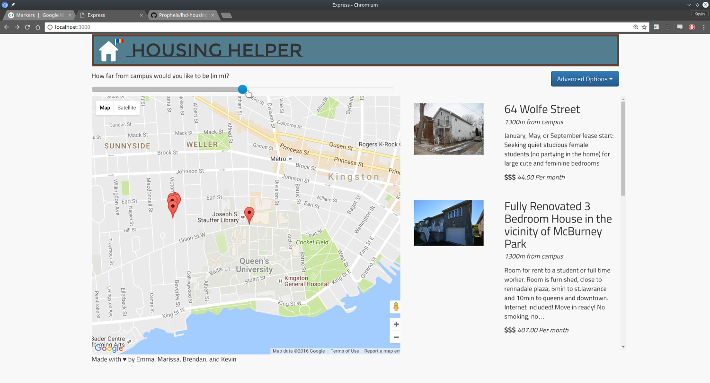

# Local Hack Day Housing Helper
A simple web app designed to help Queen's students find housing.



## Installation
You need [NodeJS](http://nodejs.org) installed to proceed.

Make sure you have [MongoDB](https://www.npmjs.com/package/mongodb) installed on your computer. If you don't, run `npm install -g mongodb`.

Now you need to create a MongoDB database on your machine. You can use the suggested commands below.

```
mkdir ~/mongodata
cd ~
mongod --dbpath=mongodata --port 27017
```

In a different terminal, run the following to:
* Clone the code to your computer
* Install the dependancies
* Start the webserver

```
git clone https://github.com/Propheis/lhd-housinghelper.git
cd lhd-housinghelper
npm install
npm start
```
and visit `http://localhost:3000/populate` to generate the sample data, followed by `http://localhost:3000/` to view the app!

You _should_ see the application running!

## Creators
Made with &#9829; by [Emma](http://github.com/efletch13), [Marissa](http://github.com/marissahuang), [Brendan](http://github.com/bkolisnik), and [Kevin](http://github.com/propheis)

## Tech Used
* MEAN Stack
    - MongoDB
    - ExpressJS
    - Angular (didn't use)
    - NodeJS
* KnockoutJS for front-end templating
* HandlebarsJS for back-end templating
* jQuery for AJAX & Animations
* Bootstrap & Bootstrap Slider for fast prototyping
* FontAwesome for icons
* Google Fonts for fonts (duh)
* FakerJS to create sample data
* JsDelivr for CDN